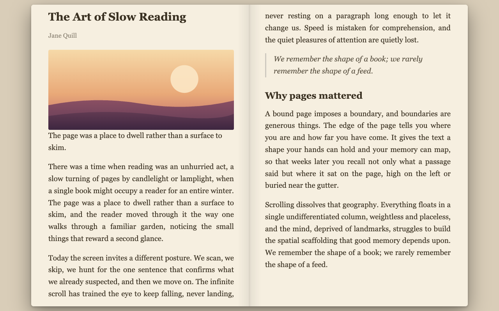

# Open Book Reader

<p align="center">
  
</p>

<p align="center">
  <a href="https://chromewebstore.google.com/detail/kmcomogkbbdjhfocbncljmgcnfmaljca"><b>Install from the Chrome Web Store</b></a>
  &nbsp;·&nbsp;
  <a href="https://kouxing2000.github.io/open-book-reader/">Website</a>
</p>

Turn any long web article into a **two-page open-book view** with keyboard page-flipping.
Extracts the article with Mozilla Readability, paginates it into left/right pages, and lets
you flip with the arrow keys — with a realistic page-turn (soft paper curl or 3D book), paper /
light / dark themes, adjustable font, all settings synced.

**Open source (MIT).** The whole extension lives in this repo — reading is fully local and
nothing is sent to the developer, so you can read every line and verify that yourself.

## Load unpacked (development)

1. Go to `chrome://extensions`
2. Enable **Developer mode** (top right)
3. **Load unpacked** → select this folder
4. On any article, click the toolbar 📖 icon or press **Alt+B**

## Controls

| Action | Keys |
|---|---|
| Next / prev page | `→` `↓` `Space` `PageDown` / `←` `↑` `PageUp` |
| First / last | `Home` / `End` |
| Font size | `+` / `−` |
| Theme | `T` |
| Exit | `Esc` or click the toolbar icon again |
| Page edges | click left / right edge to flip |

The reader **resumes where you left off** — reopen an article and you land on the same page —
and shows a slim progress bar plus an estimated reading time as you go.

Settings (font, theme, width, spine, line height) live on the options page and sync via
`chrome.storage.sync`. Per-article reading positions are kept locally (`chrome.storage.local`),
not synced.

## Architecture

```
manifest.json            MV3: action + 2 commands + permissions
src/background.js        service worker — injects engine on gesture; runs downloads
src/content/
  settings.js            shared defaults + storage helpers (globalThis.OBR)
  readability.js         bundled Mozilla Readability (Apache-2.0)
  reader.js              text engine: extract → paginate → navigate (Shadow DOM)
  zip.js                 minimal ZIP writer (OBR._buildZip)
  gallery.js             image mode: collect images → masonry + lightbox (Shadow DOM)
src/options/             options page (html + js)
icons/                   16/32/48/128
```

Two modes: **text** (Alt+B) and **image gallery** (Alt+Shift+B). The engine is injected
**only when invoked** — nothing runs against any page otherwise. Styles use Constructable
Stylesheets inside a Shadow DOM, so strict-CSP sites can't block or interfere.

## Permissions

Installed with a minimal set — nothing scary at install time:

- `activeTab` + `scripting` — render the reader/gallery on the page you invoke it on
- `storage` — remember your settings
- `contextMenus` — the right-click "Open in Book Reader" menu and per-site rules
- `commands` (manifest) — the Alt+B / Alt+Shift+B shortcuts

Requested **only on first use, never at install** (optional permissions):

- `downloads` — save images you explicitly download from the gallery
- `<all_urls>` host access — fetch image bytes cross-origin to bundle a ZIP you request

No data collection, no telemetry, nothing sent to the developer. The extension makes
network requests **only when you explicitly download images** (the browser fetches those
image URLs to save them). Core reading/extraction is fully local.

## Store assets

`npm run screenshots` loads the unpacked extension into headless Chromium and writes the
Chrome Web Store listing images to `store-assets/` (gitignored — regenerate any time):

- `01-reader-paper.png` … `05-options.png` — five 1280×800 feature shots (text reader paper +
  dark/3-column, gallery masonry, lightbox, options page)
- `promo-440x280.png` — the 440×280 promo tile

Shots are driven by the demo fixtures in `tests/fixtures/demo-*.html`, so they need no network.

## Website

The public landing page + privacy policy live in `site/` and are hosted on **GitHub Pages**,
auto-deployed by `.github/workflows/pages.yml` on every push to `master`:

- **Site:** https://kouxing2000.github.io/open-book-reader/
- **Privacy policy:** https://kouxing2000.github.io/open-book-reader/privacy.html (use this URL in the store listing)

Static HTML, no build step — just edit `site/` and push. (One-time repo setup: **Settings →
Pages → Build and deployment → Source = "GitHub Actions"**.)

(The screenshots in `site/img/` are copies of `store-assets/` — refresh them after
`npm run screenshots` if the UI changes.)

## Store listing

All Web Store listing copy + the asset→slot mapping live in **`store/LISTING.md`** — the
source of truth to paste from when submitting a new version (item ID, description,
permission justifications, privacy answers, URLs). Listing fields are dashboard-only; the
API (`npm run deploy`) only uploads/publishes the package.

## Before publishing (checklist)

- [x] Set `homepage_url` in `manifest.json` to the live site
- [x] Host the privacy policy publicly — https://kouxing2000.github.io/open-book-reader/privacy.html
- [x] Capture 1280×800 screenshots + 440×280 promo tile — `npm run screenshots`
- [ ] Data-disclosure form: **no data collected / transmitted**; note network requests occur
      only on user-triggered image downloads. `downloads` + `<all_urls>` are optional and
      requested at first download, so install asks for none of them.
- [ ] Confirm single-purpose description matches behavior
- [ ] Bump `version` per release
- [ ] Update the "Add to Chrome" link in `site/index.html` once the store listing is live

## Contributing

Contributions welcome — it's a no-build, zero-dependency extension, so the loop is just edit +
reload. See [`CONTRIBUTING.md`](CONTRIBUTING.md) for the dev setup and the reload gotcha,
[`CHANGELOG.md`](CHANGELOG.md) for the release history, and [`SECURITY.md`](SECURITY.md) to
report a vulnerability privately.

## Credits

Article extraction by [Mozilla Readability](https://github.com/mozilla/readability) (Apache-2.0,
see `src/content/READABILITY-LICENSE.md`).

## License

[MIT](LICENSE). Bundled Mozilla Readability is Apache-2.0 (`src/content/READABILITY-LICENSE.md`).
